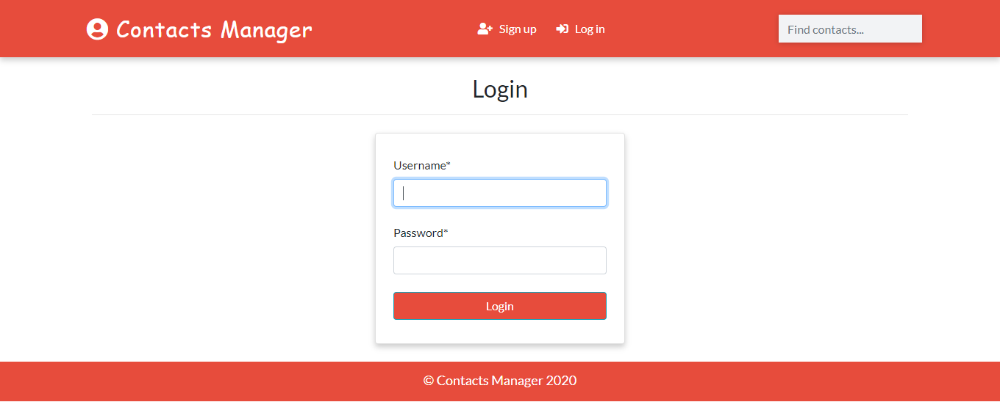

<h1 align="center">연락처-관리자-앱-장고</h1>
<a href="#">
  <div align="center">
    
  </div>
</a>

## 기능
- [x] 사용자 인증
- [x] 검색
- [x] 관리자로부터 실시간 업데이트
- [x] 삭제
- [x] 성별에 따른 필터링
- [x] 프로필 이미지


## 실행 방법
```
git clone https://github.com/saadhaxxan/Contact-Manager-Django.git
cd Contact-Manager-Django
python manage.py runserver
```
## 관리자 패널에 접근하기
```
python manage.py createsuperuser
```

## 저자
제 링크드인 프로필에서 저와 연락할 수 있습니다:

#### Saad Hassan
[](https://www.linkedin.com/in/saadhaxxan)

제 깃허브 프로필을 팔로우하여 최신 프로젝트에 대한 소식을 받아볼 수도 있습니다: [](https://github.com/saadhaxxan)
